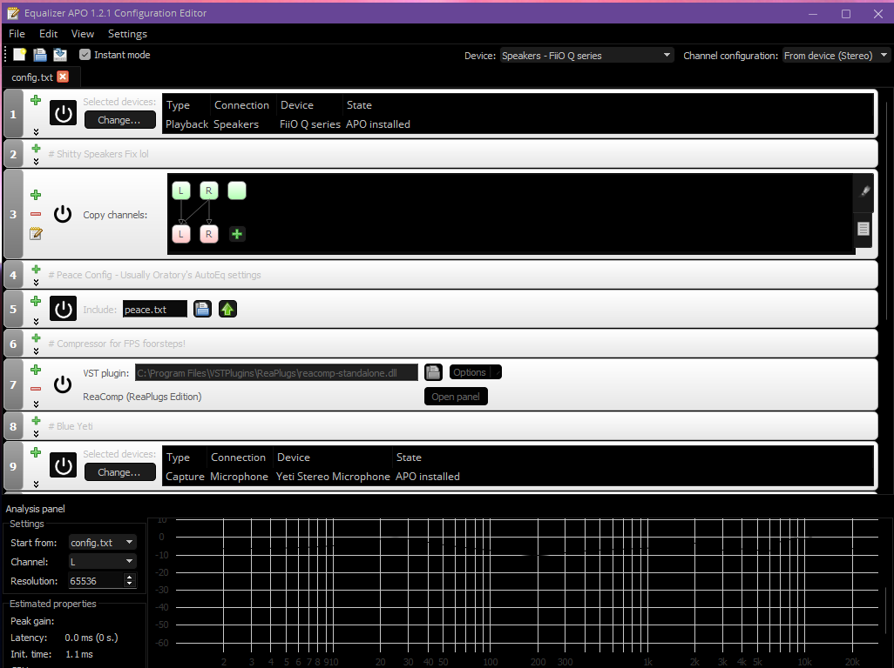
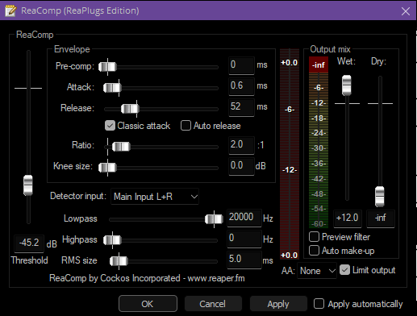

# Audio

## Goals

* Making audio **better**
* Gaining an advantage in hearing without increasing volume to dangerous levels (= healthy)

# Making audio better

## EqualizerAPO

What is EqualizerAPO? It's a system-wide audio post-processing suite. It allows to chain together EQs, Gates, compressors, etc.
It can be a bit overwhelming because of this since it's a very deep & complex software with a lot of (unfriendly) configuration options.

Download EqualizerAPO: [https://sourceforge.net/projects/equalizerapo/files/latest/download](https://sourceforge.net/projects/equalizerapo/files/latest/download)

During the installation process the program Configurator.exe will be run. Make sure that you select the correct audio device to install the APO to. If you are unsure you can open Start Menu -> Control Panel -> Sound and look for the default output device. If you need to install the APO to other audio devices later, you can run the program again from `C:\Program Files\EqualizerAPO\Configurator.exe`.

Now reboot.

**Important**:

You need to disable all the audio enhancements that are enabled on your sound card / device, like so

## Peace EqualizerAPO UI

Why I mentioned unfriendly UI, Peace is there to solve it. Install it after installing EqualizerAPO & rebooting.

Download Peace Equalizer UI: [https://sourceforge.net/projects/peace-equalizer-apo-extension/files/latest/download](https://sourceforge.net/projects/peace-equalizer-apo-extension/files/latest/download)

## Install Reaper VST filters (compressor, gate etc)

Download Repaer VST Filters: [https://www.reaper.fm/reaplugs/](https://www.reaper.fm/reaplugs/)

Take the appropriate file for your system (should be 64bit for 99.99% of people), and install the filters.

## Headphone EQ Setup

* Open Peace UI
* Find your headphones by searching for the model here: [https://github.com/jaakkopasanen/AutoEq/tree/master/results](https://github.com/jaakkopasanen/AutoEq/tree/master/results)
    * Now go to the proper folder and download the .txt file that contains `ParametricEQ` in its name.
* Follow the setup guide for Peace here: [https://github.com/jaakkopasanen/AutoEq#peace](https://github.com/jaakkopasanen/AutoEq#peace)
* Now your headphones will sound "flat" which means that they don't produce any distortion whatsoever. You might notice that your volume is now lower than it was, and it's intended. Feel free to raise your volume again. Try listening to music or something, you'll find that it now sounds much better.

## Making the setup clean

One last thing needed. Right now your newly applied EQ is applied to *all* the devices you selected when you installed EqualizerAPO. This can include your microphone as well, and we don't want that. Open `C:\Program Files\EqualizerAPO\Editor.exe`

You'll be presented with this interface

Okay, mine looks a bit more complete than yours very probably, but we'll come to that later.

* For now, press the green "+" next to the line that does an `Include: peace.txt`. Go to Control > Device (Select device)
* Move the newly added line by grabbing it from the left side (with the numbers) to make it priority one, so move it to the top.
* Click "Change..." and select only your speakers/headphones/whatever soundcard you're targeting.

# Setup for FPS games (footsteps etc)

## Prequisites

I assume you followed the previous step of making audio better.

* Press the empty green "+" at the bottom.
* Select Plugins > VST Plugin
* Now click the small blue folder/file icon, and select the file located at `C:\Program Files\VSTPlugins\ReaPlugs\reacomp-standalone.dll`
* Now click on "Open Panel" and set it up like the following:

You're done!
